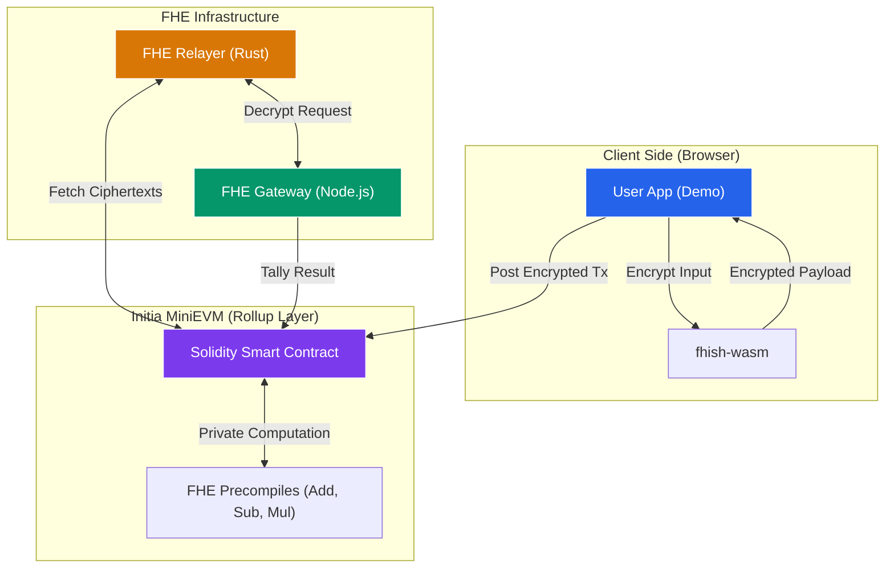

## System Architecture



## Quickstart (The Wizard Way)

The easiest way to launch your private rollup is using the **Fhish CLI**. It provides an interactive wizard that handles chain ID calculation, key generation, and service orchestration automatically.

### 1. Install the CLI (v0.1.8)
```bash
# macOS (Silicon)
curl -L -o fhish https://github.com/fhish-tech/fhish-cli/releases/download/v0.1.8/fhish-darwin-arm64
# Linux (AMD64)
# curl -L -o fhish https://github.com/fhish-tech/fhish-cli/releases/download/v0.1.8/fhish-linux-amd64

chmod +x fhish
sudo mv fhish /usr/local/bin/
```

### 2. Launch the Wizard
Run the interactive setup to provision your MiniEVM node, FHE Gateway, and Relayer:
```bash
fhish create all
```
*This command will calculate your EVM Chain ID, derive your deployer address, and generate FHE evaluation keys on the fly.*

### 3. Verify the Stack
Once the services are running, run the end-to-end verification to confirm FHE encryption/decryption is working:
```bash
fhish docker verify
```

## Stack Components
1. **`fhish-cli/`**: The main Go-based orchestrator with interactive TUI.
2. **`fhish-gateway/`**: Independent Node.js service for ciphertext data-availability.
3. **`packages/fhish-relayer-v2/`**: Rust-powered daemon for encrypted state transitions.
4. **`packages/fhish-contracts-v2/`**: Privacy-centric Solidity smart contracts.
5. **`packages/fhish-sdk-v2/`**: TypeScript SDK for client-side FHE operations.
6. **`packages/fhish-wasm/`**: Rust `tfhe-rs` bindings for native performance.

## Documentation

- [SPEC.md](SPEC.md) - Technical specification
- [ARCHITECTURE.md](ARCHITECTURE.md) - System design
- [PLAN.md](PLAN.md) - Build process
- [ROADMAP.md](ROADMAP.md) - Future goals

## License

BSD-3-Clause-Clear
